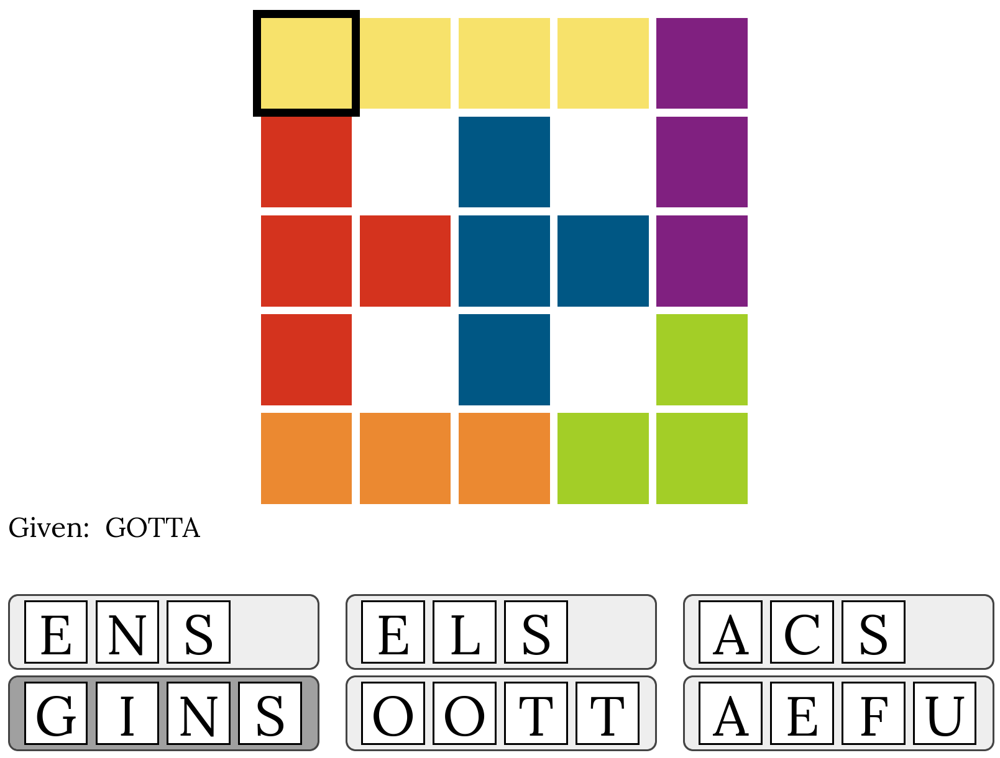

# Hueword Solver

This program uses constraint programming to solve the game [Huewords](https://huewords.snellman.net/). This game was discussed on HN [here](https://news.ycombinator.com/item?id=40571463). This Huewords solver was discussed on HN [here](https://news.ycombinator.com).

## Installation

The only requirement is a recent version of Python, and the `ortools` package:

```bash
$ python pip install ortools==9.4.9999
```

Note that the Python syntax has changed in recent versions of `ortools`, which is why you need to install an older version.

## Input file format

The format of the input file is the following:

- The given word on the first line
- The board on the lines that follow (use different numbers for the cell groups, and a dot (`.`) for empty cells)
- The letter groups in the lines that follow (one letter group per line)

For the following board:



The input file would look like this (see `example.txt`):

```
GOTTA
11112
3.4.2
33442
3.4.5
66655
ENS
ELS
ACS
GINS
OOTT
AEFU
```

## Solving the game

To solve the game, simply do:

```bash
$ python huewords-solver.py example.txt
```

## Other notes

This solver works on the current version of the game (2024-06-05). It assumes the following:
- Letter groups are always 3 or 4 letters in size.
- The words are always 5 letters long.
- There is no more than one word per row or column.

More constraint programming models can be found on [my blog](https://pedtsr.ca/).
